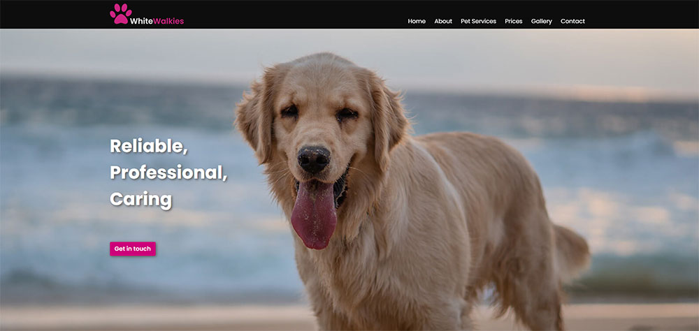
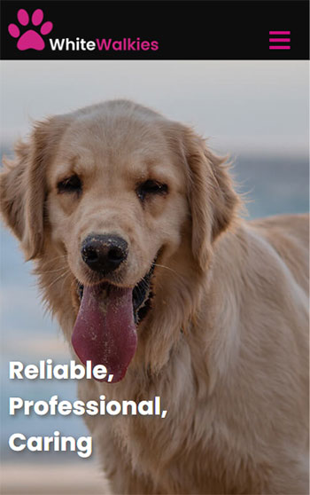
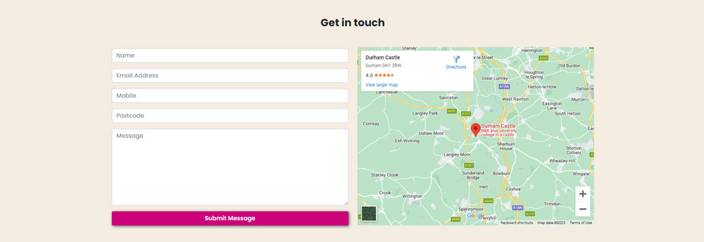
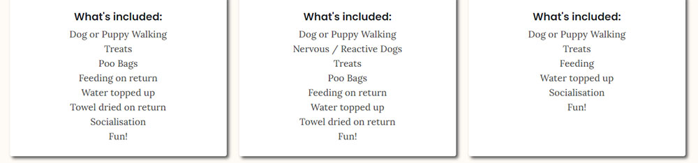
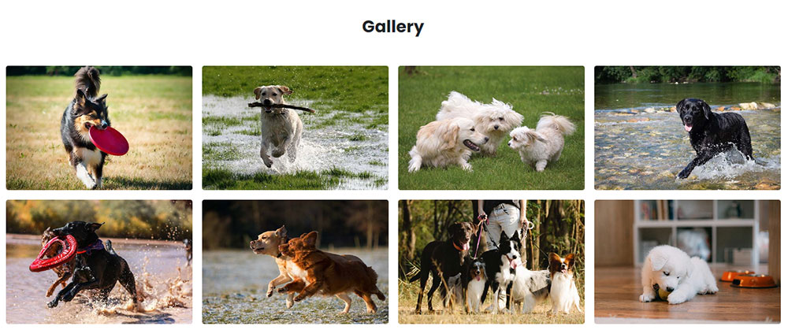
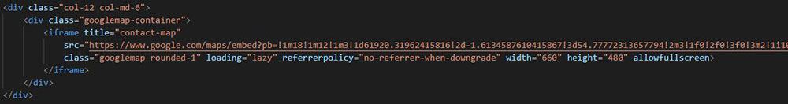

# WhiteWalkies

---

## Table of Contents

1. [About](#about)
2. [User Experiences (UX)](#user-experiences-ux)
    + [User Stories](#user-stories)
    + [Strategy](#strategy)
    + [Scope](#scope)
    + [Structure](#structure)
    + [Skeleton](#skeleton)
    + [Surface](#Surface)
3. [Features](#features)
    + [Navigation Bar](#navigation-bar)
    + [Hero](#hero)
    + [About Us](#about-us)
    + [Pet Services](#pet-services)
    + [Banners](#banners)
    + [Prices](#prices)
    + [Gallery](#gallery)
    + [Contact](#contact)
    + [Footer](#footer)
    + [Thankyou](#thankyou)
4. [Future Features](#future-features)
5. [Technologies Used](#technologies-used)
    + [Languages](#languages)
    + [Frameworks & Libraries](#frameworks--libraries)
    + [Programs](#programs)
    + [Websites](#websites)
6. [Testing](#testing)
    + [Testing User Stories](#testing-user-stories)
    + [Validation](#validation)
    + [Responsiveness](#responsiveness)
    + [Browser Compatibility](#browser-compatibility)
    + [Performance](#performance)
7. [Deployment](#deployment)
    + [GitHub Pages](#github-pages)
    + [Forking the GitHub Repository](#forking-the-github-repository)
    + [Cloning the GitHub Repository](#cloning-the-github-repository)
8. [Credits](#credits)
    + [Media](#media)
9. [Acknowledgements](#acknowledgements)

---

## About

WhiteWalkies is a business that offers dog/puppy walking and dog/puppy sitting services to people in and around the Durham area by one of it's trained staff. The site will target individuals who are in need of one or both of these services, as well as the possibility of opening up lines of communication into other dog/puppy/pet services that could potentially be offered.

The user will benefit from having a basic insight into a company that offers the very best in care and experience to both the customer and their dog/puppy. They will be provided with just the essential information and pricing about the services, as well as a mini gallery that will allow them to get a sense and feeling of how happy their dog/puppy will be within the care of one of it's responsibly trained staff. All this will give the user the confidence and happiness that they are making the right decision by choosing to get in touch with WhiteWalkies. 

***Click **[here](https://davewhiteh.github.io/whitewalkies/)** to view the live website.***

---

## User Experiences (UX)

### **User Stories**

**As a potential customer:**

+ At first glance I want to be engaged enough to happily navigate through the rest of the site
+ I want to have an insight into the company and where they operate
+ I want to know that they have all the checks and insurance in place
+ I want to be able to see what services they offer
+ I want to be able to see what the pricing is for each service
+ I want to see what is included in the price
+ I want to know how to get in touch with the company
+ I want to see pictures of dogs/puppies in different environments
+ I want to see what hours the company operates at
+ I want to be able to see and click on the links to their social media pages
+ I want to easily navigate through the site without becoming overwhelmed with too much information
+ I want to see where the company is located

**As the Business Owner:**

+ I want to generate new business by getting users to contact the company
+ I want users to easily navigate through the site and at the end be confident enough to contact the company
+ I want the site to show the motto of "quality over quantity" in terms of the information that is on display
+ I want to encourage users to go to our social media pages which will help boost the profile of the company
+ I want the site to be responsive so users on any platform can successfully navigate the site

### **Strategy**

**Site Goals**

This particular project is to design and create a static website that is done mainly through HTML and CSS.

The main goal for the website is to get potential customers to sign up to one or more of the services by getting them to contact the company. This will in turn not only provide an essential service to the user but also generate revenue for the business. 

The site from the off will need to be appealing in design so that it stands out and grabs the users attention which in turn will make them feel like they want to check out the rest of the site. Through making the site fully responsive and with a single page scroll navigation the site aims to be easily accessible no matter which platform the user is viewing the site on. 

The sites goal of "quality over quantity" means that the user gets just the right enough of information to digest, and with pleasantly pleasing images of happy dogs/puppies throughout the site, this will hopefully give the user a warm and confident feeling that they could potentially see their own dog/puppy being in the care of one of the trained staff members.

### **Scope**

The main features that will be implemented into the website will be included in six sections that will be navigated via a single scrollable page.

The design of the site should be friendly adopting a warm feeling throughout but also be eye catching enough as to stand out from the crowd in terms of other websites within the same industry. A colour palette was chosen and fonts selected at this point to help create this design.

**Homepage**

This will offer a stand out navigation bar that will be fixed to top so when scrolling through the site the user at any point can skip or go back to certain sections on the page. The hero image will be a video that is a looping 30 secs clip of the dogs on the walk, this will only be a video on desktop's and will change to an image on both tablet and mobile devices. This is so that we make sure load times on smaller devices are kept as low as possible and that we don't use too much of the users data.

**About Us**

We will use warm neutral colours with this section that will ultimately give the user a small but informative insight into the business, who we are, where we operate and what we offer.

**Pet Services**

This section will contain small descriptive paragraphs, as well as some pleasing imagery that will give the user an explanation of the services that the company offers.

**Prices**

This is where we contain the pricing and what is actually included in that price for each service. This is an important section that provides essential information. We don't want to overwhelm the user so we include only the information that is relevant in a clear format that easy to digest. We could also add some stand out information that reassures and lets the user know that the staff are fully compliant and have checks in place.

**Gallery**

This section will showcase some of the images of the dogs/puppies and will be flickable from either the left or right. This section will also include a video that will enhance the user experience by giving them a visual insight into how much fun there dog/puppy could be having with WhiteWalkies.

**Contact**

This will be where the user inputs there relevant information where they will be able to get in touch with the company. It will also contain a map indicating where the company is actually located.

**Footer**

The footer should stand out like the nav bar and will contain all the social media links for the user to be able to just click and be taken to the relevant page. It will also contain the opening times for the company, the address and contact telephone numbers which is another form in which the user could contact the company. These three parts will have icons above them which will allow the user to easily identify one of the parts before actually reading should they just want to look for that part of the footer.

**Thankyou**

A thankyou page is essential for site branding. The user will be re-located after they submit their message in the contact section. The page will contain a simple, short message that shows the appreciation from the site owner to the user for getting in touch. It will contain both the header and footer and also a link that gets them back to the homepage.

### **Structure**

The structure of the site consists of a single scrollable page rather than multiple separate pages. This should give a more accessible experience for all and by doing so will adopt a more mobile-first design which is how the majority of people view websites these days. This approach also provides less steps for the user which will hopefully minimise the risk of the user losing interest.

The single page will be made up of the Header and Footer as well six main sections, Homepage, About Us, Pet Services, Prices, Gallery and Contact. Each section will be clearly identified using design elements. They will have a bold heading that will be clear and concise, with text that is informative and intuitive, both of which will conform to the accessibility standards. Images where necessary will be relevant to that part of the section. We also want to offer the user the opportunity to get in touch at every section on the page when navigating through, so there will be a button that will allow the user to go straight to the contact section.

The header will be designed in a way that captivates the user with the use of good colour combinations. It will consist of the company logo and a nav section which will be text on desktop and then be a list with a hamburger icon for smaller devices.

In the middle part of the single scrollable page there will be an image which will act as a breather for the user that will be a fixed background image. On the top and the bottom of this image there will be a banner that will stand out and catch the users eye. The top banner will have some icons that will immediately appeal to the user with some clearly stated text about the company. The bottom banner will be short and provide the social media links for the user to click on.

The footer will use the same colour combination as the header and will contain the social media links and relevant business information, opening hours, address and telephone numbers. These will have icons above them to capture the user's attention and to indicate the information that is displayed.

### **Skeleton**

The design tool figma was used to create the wireframes which are an initial outlay of the layout of the site. There were three frames created. Each frame representing a different device and each frame measured in pixels. This was done to show the responsiveness of the layout on different devices.

Desktop (1920 x 1080) 
Tablet (1024 x 1366) 
Mobile (393 x 852)

Wireframes

The wireframes were then built on by creating an actual fully designed site using the colour palette, fonts and images that were selected when initially scoping out the site. Planning and being as prepared as possible was the key reason for generating the full designs using figma.

Having the design already laid out with the bulk of the main elements, like which colours work well together, which elements were coloured what, which font to use for what text, which images to use and where they are placed, having all these factors planned out makes the coding of the site easier to focus on and more straightforward.

Design Layout

### **Surface**

**Colour**

The colours within the chosen palette work well together. They were chosen using the site [color-hex.com](https://www.color-hex.com/color-palette/17298). They contain neutral sandy colours, which give a sense of warmth and comfort to the user when scrolling through the main bulk of the sections. The palette then contains the black and pink which are used on parts of the site that require a more commanding presence, that allows them to stand out and keep the user engaged. The pink also portrays the sense of love and fun which are two of the biggest emotions that people think of when they are around there dog/puppy.

Tints and Shades of these colours are used also and are created using the site [maketintsandshade.com](https://maketintsandshades.com/#CC007A,F5D59A,575757).

**Typography**

The font Poppins was chosen for the headers and the text that required more prominence. To find a font that would be used for the main body of the text was done via an online pairing tool called [fontpair.co](https://www.fontpair.co/pairings/poppins-lora). Both these fonts are available at [Google Fonts](https://fonts.google.com/).

**Images**

The images have been chosen carefully and where necessary reflect the description of the text that goes with them. The images are all of dog/puppies and they are all of a happy nature set in different environments, this portrays the variation of walks that they get to experience and that the user can easily relate to. The video has been selected to give the user a more in depth vision of what they can expect when their dog is in the care and supervision one of the trained dog/puppy walkers. All the individual images and video sources can be found in the [credits](#credits) section.

**Icons**

The icons used are all found at Font Awesome. Having icons as the social media links immediately allows the user to easily identify which social media platform is which. The icons on the footer used to identify the opening hours, address and telephone numbers are all easily appealing on the eye for the user.

---

## Features

### **Navigation Bar**

Images

**Desktop**

**Mobile**

+ Features on both the index.html and thankyou.html pages and is fully responsive. It contains a brand logo which links to the homepage. It also has the links Home, About, Pet Services, Prices, Gallery and Contact which are used to navigate through the site sections on the single scroll page layout.

+ The navbar is fixed and so will stay at the top of the page when the user scrolls through the site. This allows for easy accessibility should the user require the navbar to jump to any section at anytime whilst scrolling through the site.

### **Hero**

Images

**Desktop**

**Mobile**

+ The hero has a full width fixed image which has text that slides in from the left and a button just below this text that links to the contact section on the page. The image is responsive, targeting the main part of the image when it scales down. Both the text and button are also responsive in size and position as well not appearing at all on smaller screen sizes.

+ The user is introduced to the company with a stand out image that really captures the essence of the company and the animated text just adds that extra touch of something special.

### **About Us**

Images

**Desktop**

**Mobile**

+ The about us section is a simple layout which features the section header, a few paragraphs of text and the button that links to the contact section.

+ The user will be given a brief introduction as to who the company are, what they can expect from the company and allow them to go straight to the contact section of the page.

### **Pet Services**

Images

**Desktop**

**Mobile**

+ This section features firstly the section header followed by two cards, one for each service that the company currently offers. Each card has a relevant image, the service header, a brief paragraph of that service and a button that links to the contact section.

+ The users attention will be immediately linked to the images which both give a sense of what that particular service is likely to offer. The text is short but gives the user enough understanding as to what the service is about and the button will allow them to gain more info by navigating straight to the contact section.

### **Banners**

Images

**Desktop**

**Mobile**

+ This part of the site contains a fixed image that has a banner at the top of the section which has three captions. All three captions have an icon, header and text. The banner at the bottom of the section features a single line of text and three social media links for facebook, twitter and instagram.

+ This middle part of the site offers the user some quick punchy advertisement about the company with a pleasant background image that gives the user a sense of fun and happiness.

### **Prices**

Images

**Desktop**

**Mobile**

+ This section features the section header to begin with, followed by three cards, a strip of text and again the button that links to the contact section. The three cards each feature the header of the service, the price of the service and then what is included in that service. The strip of text is there to give the user a reminder as to the essential items that we offer.

+ The section will give the user the all important costs of the service that the company provides. It will also allow the user to understand what they will get from the company for that price and that service.

### **Gallery**

Images

**Desktop**

**Mobile**

+ The gallery section features eight images that are responsive in terms of the layout and have been carefully selected. A video to a youtube video has been embedded below the images showing two dogs playing happily at the park.

+ This section is important to the user as it taps into there emotional side, offering them an insight into what the company offers, as well how the dogs are portrayed in the companies care. The video in this section also really helps give a positive vibe as videos are more interactive, enhancing the user experience within this section.

### **Contact**

Images

**Desktop**

**Mobile**

+ The features within this section are a form that includes Name, Email Address, Mobile, Postcode, Message and submit button, as well as a map pinpointing the company and the surrounding areas. Both form and map are side by side and are fully responsive in that the map will be underneath the form on smaller screen sizes.

+ The user will use this section to contact company about any/all of the services or general enquiries. They will need to fill out the form and then submit which will then lead them to the [thankyou page](#thankyou). The map offers the user the all important understanding of where the company is situated and the areas around where the company operates.

### **Footer**

Images

**Desktop**

**Mobile**

+ The footer features the time in which the company operates at, the address of the company and the telephone numbers. All three parts of the footer have easy to understand icons. At the bottom of the footer there are the social media links and then a line of text with the copyright statement for the site.

+ The user will be able to gain essential information regarding the company as well as giving them links to three social media platforms.

### **Thankyou**

Images

**Desktop**

**Mobile**

+ This entirely different page features both the navbar and footer from the main index.html page. It also features an icon of a dog, a header with a short piece of text underneath. This is all followed by a button which links back to the homepage and another link underneath which links to the contact section in the main index.html page.

+ The user will get to know that there message has been sent successfully and the timeframe as to the response of that message. This is all based around the familiar branding of the main index.html page.

---

## Future Features

+ To include a 404.html page. This again enhances the user experience by giving them that all familiar branding which could potential keep the user from leaving the site altogether.

+ To change the images within the gallery to use a carousel slider. This should be fully responsive allowing for different numbers of images within the carousel depending on which screen size the gallery is being viewed on.

+ To offer more services, therefore enhancing what we can offer potential users and also providing more revenue streams within the business.

---

## Technologies Used

### **Languages**

+ [HTML5](https://en.wikipedia.org/wiki/HTML5)
+ [CSS3](https://en.wikipedia.org/wiki/CSS)

### **Frameworks & Libraries**

+ [Bootstrap 5.2](https://getbootstrap.com/docs/5.2/getting-started/introduction/)
    + used to create the structure and layout of the website, making it responsive on all devices.
+ [Google Fonts](https://fonts.google.com/)
    + used to get the links to the fonts that are put in the head of the html pages. These fonts are then used throughout the website.
+ [Font Awesome](https://fontawesome.com/)
    + this was used to add icons to the project.
+ [Git](https://git-scm.com/)
    + was used for version control in order to add, commit and push from GitPod to GitHub.
+ [GitPod](https://github.com/)
    + is used as a repository and to host the full project.
+ [GitHub](https://www.gitpod.io/)
    + is the IDE that is used to develop the a whole site.

### **Programs**

+ [Adobe Illustrator](https://www.adobe.com/uk/products/illustrator.html)
    + illustrator is used to create the websites main logo.
+ [Adobe Photoshop](https://www.adobe.com/uk/products/photoshop.html)
    + is used to resize all the images that are used within the project.

### **Websites**

+ [Fontpair](https://www.fontpair.co/)
    + this site was used to pair the two main fonts that are used throughout the whole site.
+ [Color-hex](https://www.color-hex.com/)
    + was used to choose the colour palette that was used through the website.
+ [Make Tints and Shades](https://maketintsandshades.com/)
    + used to create the tints from the main colour palette for use on the whole site.
+ [Figma](https://www.figma.com/)
    + used to create the wireframes and design layout for the project.
+ [Pexels](https://www.pexels.com/)
    + this site was used to source images that would be used within the website.
+ [Unsplash](https://unsplash.com/)
    + this site was used to source images that would be used within the website.
+ [Pixabay](https://pixabay.com/)
    + this site was used to source images that would be used within the website.
+ [The Noun Project](https://thenounproject.com/)
    + was used to source the dog icon used in the thankyou page.
+ [Favicon](https://favicon.io/)
    + used to create the favicon for the website pages tab.
+ [Am I Responsive?](https://ui.dev/amiresponsive)
    + used to create the responsive mock-up image that is at the beginning of the readme file.
+ [Chrome DevTools](https://developer.chrome.com/docs/devtools/)
    + this was used throughout the whole project, from creating the site, testing the responsiveness of the site and then testing the performance.
+ [W3C CSS Validation Service](https://jigsaw.w3.org/css-validator/)
    + this site is used to validate the css which was used to style the site.
+ [W3C HTML Validation Service](https://validator.w3.org/)
    + used to validate the html for both the index and thankyou pages in the project.
+ [W3Schools](https://www.w3schools.com/)
    + this site was used a reference site for learning purposes.
+ [Stack Overflow](https://stackoverflow.com/)
    + was used for seeking out answers and general learning purposes.

---

## Testing

### **Testing User Stories**

**As a potential customer:**

**At first glance I want to be engaged enough to happily navigate through the rest of the site**

Images

+ As soon as the user loads the site they are immediately greeted with a full width and height hero image that has the added effect of animated text that slides in from the left hand side. There is a button in pink that is just below this text allowing the user to go straight to the contact section. The use of the black and pink for the navbar work well together and allows this first page to really capture the users attention upon first glance.

**I want to have an insight into the company and where they operate**

Images

+ There is the about us section which offers a brief insight into the company. This gives them an introduction and what they can expect from the company.
+ The user can scroll to the bottom of the page and they will see a map of the area in which they can pinpoint the company and the surrounding areas in which they operate.

**I want to know that they have all the checks and insurance in place**

Images

+ Firstly the checks are highlighted within the about us section. The important words insured, licensed, DBS/CRB and Canine first aid, are all in bold. This is so the user can easily see that the company has the necessary certifications and checks in place.
+ They are then identified in the middle section of the page which is is easily picked up by the user with the use of icons and short snappy text.
+ The third time that these checks are highlighted is just after the prices. It is subtle and just reiterates to the user that the company has all the correct documents to give them peace of mind and to reassure them that there dog/puppy will be in the best of care.

**I want to be able to see what services they offer**

Images

+ There is a full section in regards to the services that the company offers. Each service has it's own image which relates to that particular service, the header of the service, a brief description and then a button that links to the contact section at the bottom of the page.

**I want to be able to see what the pricing is for each service**

Images

+ There is a section that is all about the pricing for each service that the company offers. The prices are in different colours to the rest of the text so that they immediately catch the users eye.

**I want to see what is included in the price**

Images

+ What is included for that price is also within the price section of the page. This is set out with clear easy to read text so that user knows exactly what they will be getting for the price of that particular service.

**I want to know how to get in touch with the company**

Images

+ On each section there is a button that is clear and concise and is coloured in pink that allows it to stand out from each section. The link will navigate the user to the contact section at the bottom of the page.
+ Once the user gets to the contact section there is a form that is simply set out for the user to enter their details and a message and then submit that message using the submit button at the bottom of the form.

**I want to see pictures of dogs/puppies in different environments**

Images

+ The next section that offers images for the user to see is the pet services section. This offers two images one for each service. Each image relates to that particular service on offer.
+ There is the banner image in the middle part of the site. This image is a full width fixed image that the user can fully enjoy whilst the text scrolls over it.
+ Then the user will come to the gallery section which offers eight images in total. All of which shows the dogs/puppies within different environments which will allow the user to get a glimpse into what types of experiences there dog/puppy will be given with the care of the company.

**I want to see what hours the company operates at**

Images

+ The companies operating hours can be located in the footer. The text is white and so stands out from the black footer. It also has an icon of a clock coloured in pink, that allows the user to clearly identify what this part of the text is showing.

**I want to be able to see and click on the links to their social media pages**

Images

+ In the middle of the website there is a full width banner that has a single line text with three social media icons underneath, for facebook, twitter and instagram. These stand as they are coloured pink which works well against the almost black background. When the icons are hovered over they turn to a dark beige allowing the user to clearly see which platform they are about to click.
+ These same three icons with the same features can also be found in the footer.

**I want to easily navigate through the site without becoming overwhelmed with too much information**

Images

+ The site's goal has clearly been set out with the "quality over quantity" attitude. There is not huge amount's of text that could potentially overwhelm the user, instead there is clear and concise text where it is required.

**I want to see where the company is located**

Images

+ The user can scroll to the bottom of the page and they will see a map of the area in which clearly pinpoints where the company is located.
+ They can also use the address which is highlighted in the footer.

**As the Business Owner:**

**I want to generate new business by getting users to contact the company**

Images

+ This has been achieved by having a button on each section that offers the user the opportunity to go straight to the contact section at the bottom of the page without the need to continue to scroll.

**I want users to easily navigate through the site and at the end be confident enough to contact the company**

Images

+ The site has been designed with a single scroll layout which helps keep the navigation of the site short and simple. This in turn with just the right amount of text and carefully selected imagery should give the user enough incentive to get in touch.

**I want the site to show the motto of "quality over quantity" in terms of the information that is on display**

Images

+ The information on the site has been selected so that it gives the user clear understanding of the companies views and quality of standards without the need to write paragraphs of information. 

**I want to encourage users to go to our social media pages which will help boost the profile of the company**

Images

+ This has been achieved at two points within the site. The first in the middle section which scrolls over the full width fixed background image. The second is located in the footer. In both locations the social media icons are pink allowing the user to easily identify which icon represents which platform. Once the user hovers over the icons they turn dark beige which allows the user to easily be aware of which social media platform they are clicking on.

**I want the site to be responsive so users on any platform can successfully navigate the site**

Images

+ This has been achieved by using the bootstrap framework which utilises the grid system. There has also been styles within the css set out into media queries which have also help form the responsive design of the site.

### **Validation**

**HTML**

Image

The HTML was tested using the validation site W3C HTML Validation Service. No errors were found.

**CSS**

Image

The validation site W3C CSS Validation Service was used to validate the CSS. No errors were found. There were 9 warnings, however these were to do with vendor extensions.

### **Responsiveness**

**Live**

The site was tested on the following live devices:
+ **iiyama desktop monitor - 1920x1080 resolution**
    + the site performed smoothly and was as expected, with no known issues to report.
+ **Google Pixel 5**
    + the site was rigorously tested throughout in both orientation's. The site loaded quickly and was responsive. The functionality of the site worked well. There was a slight lag when hitting the Gallery section of the site (for details please click [here](#lag-on-scroll)). Also an odd effect was noticed when scrolling over the two fixed background-images (hero and banner) the image was then zoomed in (for details please click [here](#bugs-and-fixes)). This was only picked up, after multiple times of scrolling through the site. This didn't have any overall affect on the site responsiveness or functionality.
+ **Google Pixel 6a**
    + the site was tested by a different user. Their comments were very positive. Great design with good functionality and easy to navigate. They did not mention the slight lag on screen and were not aware of the zoom in on the two background-images. They did however make a comment on the navbar, in that it did not auto close once they clicked on a section (for details please click [here](#navbar---auto-close-on-click)).
+ **Amazon Fire Tablet HD**
    + when testing on the Fire Tablet again responsiveness was great, the elements worked well on the page and functionality had no issues. As it was highlighted on the pixel 5 testing there was the slight issue with the background-images zooming in (for details please click [here](#bugs-and-fixes)).
+ **iPhone 11**
    + the site was tessted using an iphone by a different user. The comments receieved about the site was really positive. They commented how easy it was to navigate through. There was an issue with the two background images, these did not appear on the iphone using safari as its browser (for details please click [here](#bugs-and-fixes)).

**Simulation**

The site was also tested using Chrome Developer Tools on the following setups:
+ iPhone SE
+ iPhone XR
+ iPhone 12 Pro
+ Pixel 5
+ Samsung Galaxy S8+
+ Samsung Galazy S20 Ultra
+ Galaxy Fold
+ Samsung Galaxy A51/71
+ iPad Air
+ iPad Mini
+ Surface Pro 7
+ Surface Duo
+ Nest Hub
+ Nest Hub Max

The site performed as expected and was responsive, with all functionality and navigation working well.

### **Browser Compatibility**

The site was tested on the following browsers:

+ Google Chrome
+ Mozilla Firefox
+ Microsoft Edge

On all three browsers the site performed as expected with no issues found.

### **Performance**

The site was put through a performance test using Google Chrome Developer Tools Lighthouse test.

**Desktop**

Image

The site performed really well in the Lighthouse test for the desktop.

**Mobile**

Image

The site performance dipped slightly for the mobile test. However after reviewing the performance and evaluating how the site performs on actual mobile devices I was not concerned by this outcome. No actions have been taken at this time.

### **Bugs and Fixes**

#### **Navbar - Auto close on click**

This was a feature that a user picked up on when testing the site on a mobile.

+ ***Issue/Feature*** - The navbar did not auto collapse once a section had been clicked.

Image

+ ***Resolution*** - The html has been amended to accommodate this feature in both the index.html and thankyou.html. The solution was found using [stack overflow](https://stackoverflow.com/questions/42401606/how-to-hide-collapsible-bootstrap-navbar-on-click). Essentially the solution was to add an additional 'a' tag and add a 'span' for each nav-item, whereby only one of the 'a' tags would be displayed depending on the screen size.

Image

#### **Lag on scroll**

This was a slight issue that was picked up on during the rigurous testing stage on a mobile device.

+ ***Issue/Feature*** - There was a slight lag when scrolling when approaching the gallery section of the site on a mobile device.

Images

+ ***Resolution*** - This issue seemed to come from the lazy attribute on both the iframes that are included in the site. These iframes resided in the gallery section as a video and the contact section as a google map. The mobile first approach is why the decision was made to fix this issue, ultimately removing the lazy attribute from both iframes in order to keep the scrolling and essentially the user experience at a high.

Images

---

## Deployment

### **GitHub Pages**

GitHub pages was used to deploy the site.

The steps to deploy the live site are:

+ In the GitHub repository navigate to the 'Settings' tab
+ On the left hand menu click on 'Pages'
+ Under Build and Deployment > Branch select 'main' and '/root'
+ Click save
+ The link to the live website will then be displayed at the top when successfully published

### **Forking the GitHub Repository**

+ Go to the GitHub repository
+ Click on the fork button in the top right hand corner of the page

### **Cloning the GitHub Repository**

+ Go the GitHub repository
+ Click on the 'Code' button
+ In the dropdown menu click on 'HTTPS'
+ Copy the link to the clipboard
+ Open Git Bash
+ Locate the desired directory where you want to place the cloned directory
+ Type 'git clone' and then paste the copied URL
+ Press 'enter' to create the clone

---

## Credits

### **Media**

**Hero**

Ignacio Andres Yañez Grandon - https://www.pexels.com/photo/golden-retriever-standing-on-the-shore-of-a-beach-11920789/

**Pet Services**

Muscat_Coach - https://pixabay.com/photos/dog-to-play-stick-dogs-play-great-3669542/

Marieke Koenders - https://unsplash.com/photos/-Elf7vDV7Rk

**Static Background Image**

Mia Anderson - https://unsplash.com/photos/2k6v10Y2dIg

**Gallery**

Vincent van Zalinge - https://unsplash.com/photos/AjtGg8feZhg

Neelam279 - https://pixabay.com/photos/dogs-animals-dogs-play-pets-7032307/

858106 - https://pixabay.com/photos/labrador-the-dog-black-dog-881457/

C Perret - https://unsplash.com/photos/PD5pW3SrHMI

Patrick Hendry - https://unsplash.com/photos/m3TjnLvnGyQ

Blue Bird - https://www.pexels.com/photo/cheerful-woman-with-group-of-dogs-7210747/

Andrew Patrick - https://www.pexels.com/photo/close-up-shot-of-a-dog-running-6784332/

Tanya Gorelova - https://www.pexels.com/photo/a-puppy-biting-a-ball-3860309/

Lexy's Pawsome Pupdates - https://www.youtube.com/watch?v=YnRQhHzjN0A&t=12s

**Thank you**

Loren Holloway - https://thenounproject.com/icon/labrador-retriever-6254/

---

## Acknowledgements

+ Pasquale Fasulo at Bristol City College for his understanding and guidance throughout the project.
+ My mentor Rahul who helped me with the initial outlook on the whole project.
+ The Code Institute community on Slack